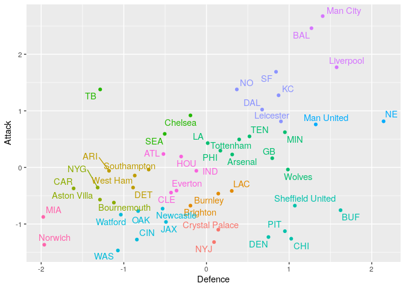

<!-- README.md is generated from README.Rmd. Please edit that file -->

# Grouping Similar NFL and Premier League Teams

<!-- badges: start -->
<!-- badges: end -->
Ever wondered which NFL team to support based upon your favourite Premier League team? This project analyses Premier League and NFL teams and aims to match/group them based upon their respective strengths.

By looking at the number of goals/points scored and conceded by each time we can assign them a offensive and defensive score. These can be standardized so that we can then compare the Premier League and NFL teams. Based upon these scores we can then use clustering to group the teams and see which Premier League and NFL teams are most similar.

For the full project report see Report.html file.

The final plot of the attacking a defensive score metrics is given below, along with the final groupings of teams.

<!-- -->

<table class="table" style="margin-left: auto; margin-right: auto;">
 <thead>
  <tr>
   <th style="text-align:left;"> Cluster </th>
   <th style="text-align:left;"> Team </th>
  </tr>
 </thead>
<tbody>
  <tr>
   <td style="text-align:left;vertical-align: middle !important;" rowspan="2"> 1 </td>
   <td style="text-align:left;"> NYJ </td>
  </tr>
  <tr>
   
   <td style="text-align:left;"> Crystal Palace </td>
  </tr>
  <tr>
   <td style="text-align:left;vertical-align: middle !important;" rowspan="3"> 2 </td>
   <td style="text-align:left;"> LAC </td>
  </tr>
  <tr>
   
   <td style="text-align:left;"> Brighton </td>
  </tr>
  <tr>
   
   <td style="text-align:left;"> Burnley </td>
  </tr>
  <tr>
   <td style="text-align:left;vertical-align: middle !important;" rowspan="4"> 3 </td>
   <td style="text-align:left;"> DET </td>
  </tr>
  <tr>
   
   <td style="text-align:left;"> ARI </td>
  </tr>
  <tr>
   
   <td style="text-align:left;"> Southampton </td>
  </tr>
  <tr>
   
   <td style="text-align:left;"> West Ham </td>
  </tr>
  <tr>
   <td style="text-align:left;vertical-align: middle !important;" rowspan="4"> 4 </td>
   <td style="text-align:left;"> NYG </td>
  </tr>
  <tr>
   
   <td style="text-align:left;"> CAR </td>
  </tr>
  <tr>
   
   <td style="text-align:left;"> Aston Villa </td>
  </tr>
  <tr>
   
   <td style="text-align:left;"> Bournemouth </td>
  </tr>
  <tr>
   <td style="text-align:left;vertical-align: middle !important;" rowspan="3"> 5 </td>
   <td style="text-align:left;"> TB </td>
  </tr>
  <tr>
   
   <td style="text-align:left;"> SEA </td>
  </tr>
  <tr>
   
   <td style="text-align:left;"> Chelsea </td>
  </tr>
  <tr>
   <td style="text-align:left;vertical-align: middle !important;" rowspan="8"> 6 </td>
   <td style="text-align:left;"> TEN </td>
  </tr>
  <tr>
   
   <td style="text-align:left;"> PHI </td>
  </tr>
  <tr>
   
   <td style="text-align:left;"> GB </td>
  </tr>
  <tr>
   
   <td style="text-align:left;"> MIN </td>
  </tr>
  <tr>
   
   <td style="text-align:left;"> LA </td>
  </tr>
  <tr>
   
   <td style="text-align:left;"> Arsenal </td>
  </tr>
  <tr>
   
   <td style="text-align:left;"> Tottenham </td>
  </tr>
  <tr>
   
   <td style="text-align:left;"> Wolves </td>
  </tr>
  <tr>
   <td style="text-align:left;vertical-align: middle !important;" rowspan="5"> 7 </td>
   <td style="text-align:left;"> BUF </td>
  </tr>
  <tr>
   
   <td style="text-align:left;"> PIT </td>
  </tr>
  <tr>
   
   <td style="text-align:left;"> DEN </td>
  </tr>
  <tr>
   
   <td style="text-align:left;"> CHI </td>
  </tr>
  <tr>
   
   <td style="text-align:left;"> Sheffield United </td>
  </tr>
  <tr>
   <td style="text-align:left;vertical-align: middle !important;" rowspan="6"> 8 </td>
   <td style="text-align:left;"> CIN </td>
  </tr>
  <tr>
   
   <td style="text-align:left;"> JAX </td>
  </tr>
  <tr>
   
   <td style="text-align:left;"> OAK </td>
  </tr>
  <tr>
   
   <td style="text-align:left;"> WAS </td>
  </tr>
  <tr>
   
   <td style="text-align:left;"> Newcastle </td>
  </tr>
  <tr>
   
   <td style="text-align:left;"> Watford </td>
  </tr>
  <tr>
   <td style="text-align:left;vertical-align: middle !important;" rowspan="2"> 9 </td>
   <td style="text-align:left;"> NE </td>
  </tr>
  <tr>
   
   <td style="text-align:left;"> Man United </td>
  </tr>
  <tr>
   <td style="text-align:left;vertical-align: middle !important;" rowspan="5"> 10 </td>
   <td style="text-align:left;"> KC </td>
  </tr>
  <tr>
   
   <td style="text-align:left;"> DAL </td>
  </tr>
  <tr>
   
   <td style="text-align:left;"> NO </td>
  </tr>
  <tr>
   
   <td style="text-align:left;"> SF </td>
  </tr>
  <tr>
   
   <td style="text-align:left;"> Leicester </td>
  </tr>
  <tr>
   <td style="text-align:left;vertical-align: middle !important;" rowspan="3"> 11 </td>
   <td style="text-align:left;"> BAL </td>
  </tr>
  <tr>
   
   <td style="text-align:left;"> Liverpool </td>
  </tr>
  <tr>
   
   <td style="text-align:left;"> Man City </td>
  </tr>
  <tr>
   <td style="text-align:left;vertical-align: middle !important;" rowspan="5"> 12 </td>
   <td style="text-align:left;"> CLE </td>
  </tr>
  <tr>
   
   <td style="text-align:left;"> HOU </td>
  </tr>
  <tr>
   
   <td style="text-align:left;"> IND </td>
  </tr>
  <tr>
   
   <td style="text-align:left;"> ATL </td>
  </tr>
  <tr>
   
   <td style="text-align:left;"> Everton </td>
  </tr>
  <tr>
   <td style="text-align:left;vertical-align: middle !important;" rowspan="2"> 13 </td>
   <td style="text-align:left;"> MIA </td>
  </tr>
  <tr>
   
   <td style="text-align:left;"> Norwich </td>
  </tr>
</tbody>
</table>

