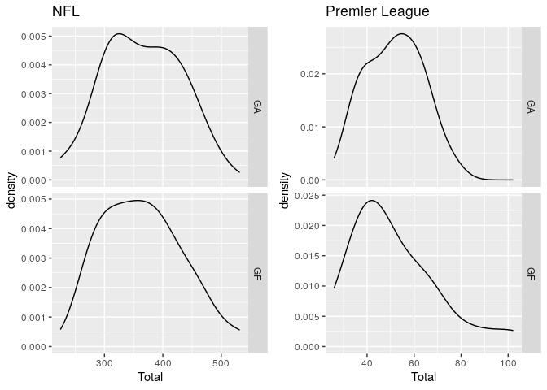
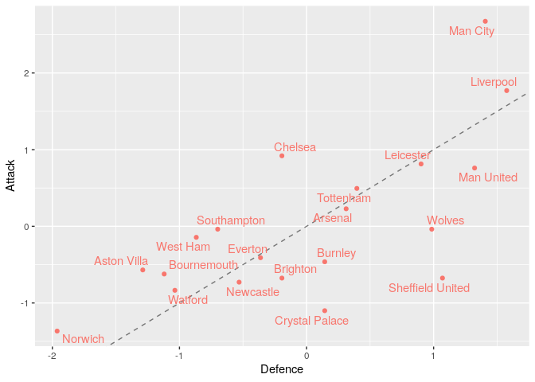
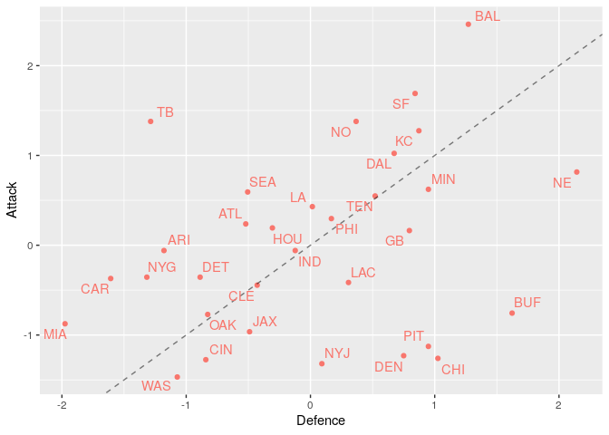
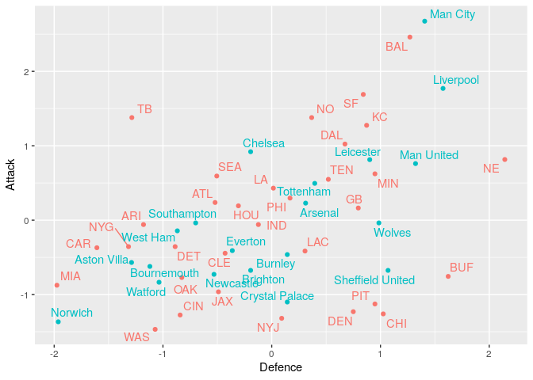
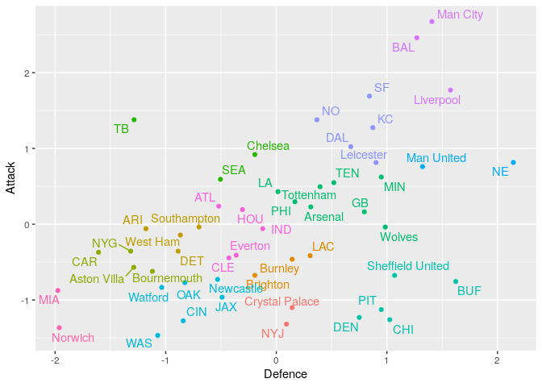

This project seeks to group Premier League and NFL teams based upon there attacking and defensive strengths. The analysis is performed in R with data obtained from <https://www.football-data.co.uk/englandm.php> and <https://github.com/leesharpe/nfldata>.

## Project Aims

* Create an attacking and defensive metric for all Premier League and NFL teams
* Visualisation of the attacking and defensive metric to compare teams
* Cluster the teams based upon the attacking and defensive metric
* Create a final grouping of the teams to allow a user to find there favourite Premier League or NFL team and find similar teams in the alternative league.

## Data Choices/Cleaning
First, we need to decide upon the data to be used in the project. Due to the Premier League having promotions and relegations, performing analysis over multiple seasons is difficult. Hence, we will use just the 2019/2020 season as this is the last fully completed season, which balances having enough data to create a relevant metric while still being relevant. As the 2020/2021 NFL season has finished we could use the most up to date season, however, in order to be consistent with the Premier League we also use the 2019/2020 season. This will also allow future analysis of the 2020/2021 season once the Premier League has finished.

Now, we need to decide upon an attacking a defensive metric for each team. We are not interested in the ability of each team as we could easily compare this across the leagues by looking at the teams standings. Hence, we will use the number of goals (points in the NFL) scored and conceded. While this will be correlated with the ability of the teams hopefully there should be more interesting conclusions than just matching the teams based upon there league placing.

### Premier League Data
The Premier League data is available at <https://www.football-data.co.uk/englandm.php> in a .csv format. The spreadsheet contains all the results from the 2019/2020 Premier League season. From this we can clean the data to obtain the number of goals scored and conceded by each team over the season. 

<div style="border: 1px solid #ddd; padding: 0px; overflow-y: scroll; height:200px; "><table class="table" style="margin-left: auto; margin-right: auto;">
<caption>Premier League Teams: Goals For (GF) and Goals Agaisnt (GA)</caption>
 <thead>
  <tr>
   <th style="text-align:left;position: sticky; top:0; background-color: #FFFFFF;"> Team </th>
   <th style="text-align:right;position: sticky; top:0; background-color: #FFFFFF;"> GF </th>
   <th style="text-align:right;position: sticky; top:0; background-color: #FFFFFF;"> GA </th>
  </tr>
 </thead>
<tbody>
  <tr>
   <td style="text-align:left;"> Arsenal </td>
   <td style="text-align:right;"> 56 </td>
   <td style="text-align:right;"> 48 </td>
  </tr>
  <tr>
   <td style="text-align:left;"> Aston Villa </td>
   <td style="text-align:right;"> 41 </td>
   <td style="text-align:right;"> 67 </td>
  </tr>
  <tr>
   <td style="text-align:left;"> Bournemouth </td>
   <td style="text-align:right;"> 40 </td>
   <td style="text-align:right;"> 65 </td>
  </tr>
  <tr>
   <td style="text-align:left;"> Brighton </td>
   <td style="text-align:right;"> 39 </td>
   <td style="text-align:right;"> 54 </td>
  </tr>
  <tr>
   <td style="text-align:left;"> Burnley </td>
   <td style="text-align:right;"> 43 </td>
   <td style="text-align:right;"> 50 </td>
  </tr>
  <tr>
   <td style="text-align:left;"> Chelsea </td>
   <td style="text-align:right;"> 69 </td>
   <td style="text-align:right;"> 54 </td>
  </tr>
  <tr>
   <td style="text-align:left;"> Crystal Palace </td>
   <td style="text-align:right;"> 31 </td>
   <td style="text-align:right;"> 50 </td>
  </tr>
  <tr>
   <td style="text-align:left;"> Everton </td>
   <td style="text-align:right;"> 44 </td>
   <td style="text-align:right;"> 56 </td>
  </tr>
  <tr>
   <td style="text-align:left;"> Leicester </td>
   <td style="text-align:right;"> 67 </td>
   <td style="text-align:right;"> 41 </td>
  </tr>
  <tr>
   <td style="text-align:left;"> Liverpool </td>
   <td style="text-align:right;"> 85 </td>
   <td style="text-align:right;"> 33 </td>
  </tr>
  <tr>
   <td style="text-align:left;"> Man City </td>
   <td style="text-align:right;"> 102 </td>
   <td style="text-align:right;"> 35 </td>
  </tr>
  <tr>
   <td style="text-align:left;"> Man United </td>
   <td style="text-align:right;"> 66 </td>
   <td style="text-align:right;"> 36 </td>
  </tr>
  <tr>
   <td style="text-align:left;"> Newcastle </td>
   <td style="text-align:right;"> 38 </td>
   <td style="text-align:right;"> 58 </td>
  </tr>
  <tr>
   <td style="text-align:left;"> Norwich </td>
   <td style="text-align:right;"> 26 </td>
   <td style="text-align:right;"> 75 </td>
  </tr>
  <tr>
   <td style="text-align:left;"> Sheffield United </td>
   <td style="text-align:right;"> 39 </td>
   <td style="text-align:right;"> 39 </td>
  </tr>
  <tr>
   <td style="text-align:left;"> Southampton </td>
   <td style="text-align:right;"> 51 </td>
   <td style="text-align:right;"> 60 </td>
  </tr>
  <tr>
   <td style="text-align:left;"> Tottenham </td>
   <td style="text-align:right;"> 61 </td>
   <td style="text-align:right;"> 47 </td>
  </tr>
  <tr>
   <td style="text-align:left;"> Watford </td>
   <td style="text-align:right;"> 36 </td>
   <td style="text-align:right;"> 64 </td>
  </tr>
  <tr>
   <td style="text-align:left;"> West Ham </td>
   <td style="text-align:right;"> 49 </td>
   <td style="text-align:right;"> 62 </td>
  </tr>
  <tr>
   <td style="text-align:left;"> Wolves </td>
   <td style="text-align:right;"> 51 </td>
   <td style="text-align:right;"> 40 </td>
  </tr>
</tbody>
</table></div>

### NFL Data
The NFL data was obtained from <https://github.com/leesharpe/nfldata>. This spreadsheet contains multiple summary statistics for each NFL team for each year. From this, we can clean the data so it shows the number of points scored and conceded by each team in the 2019/2020 season. We will abuse the NFL notation by calling renaming points as goals.

<div style="border: 1px solid #ddd; padding: 0px; overflow-y: scroll; height:200px; "><table class="table" style="margin-left: auto; margin-right: auto;">
<caption>NFL Teams: Points For (GF) and Points Agaisnt (GA)</caption>
 <thead>
  <tr>
   <th style="text-align:left;position: sticky; top:0; background-color: #FFFFFF;"> Team </th>
   <th style="text-align:right;position: sticky; top:0; background-color: #FFFFFF;"> GF </th>
   <th style="text-align:right;position: sticky; top:0; background-color: #FFFFFF;"> GA </th>
  </tr>
 </thead>
<tbody>
  <tr>
   <td style="text-align:left;"> BUF </td>
   <td style="text-align:right;"> 314 </td>
   <td style="text-align:right;"> 259 </td>
  </tr>
  <tr>
   <td style="text-align:left;"> MIA </td>
   <td style="text-align:right;"> 306 </td>
   <td style="text-align:right;"> 494 </td>
  </tr>
  <tr>
   <td style="text-align:left;"> NE </td>
   <td style="text-align:right;"> 420 </td>
   <td style="text-align:right;"> 225 </td>
  </tr>
  <tr>
   <td style="text-align:left;"> NYJ </td>
   <td style="text-align:right;"> 276 </td>
   <td style="text-align:right;"> 359 </td>
  </tr>
  <tr>
   <td style="text-align:left;"> BAL </td>
   <td style="text-align:right;"> 531 </td>
   <td style="text-align:right;"> 282 </td>
  </tr>
  <tr>
   <td style="text-align:left;"> CIN </td>
   <td style="text-align:right;"> 279 </td>
   <td style="text-align:right;"> 420 </td>
  </tr>
  <tr>
   <td style="text-align:left;"> CLE </td>
   <td style="text-align:right;"> 335 </td>
   <td style="text-align:right;"> 393 </td>
  </tr>
  <tr>
   <td style="text-align:left;"> PIT </td>
   <td style="text-align:right;"> 289 </td>
   <td style="text-align:right;"> 303 </td>
  </tr>
  <tr>
   <td style="text-align:left;"> HOU </td>
   <td style="text-align:right;"> 378 </td>
   <td style="text-align:right;"> 385 </td>
  </tr>
  <tr>
   <td style="text-align:left;"> IND </td>
   <td style="text-align:right;"> 361 </td>
   <td style="text-align:right;"> 373 </td>
  </tr>
  <tr>
   <td style="text-align:left;"> JAX </td>
   <td style="text-align:right;"> 300 </td>
   <td style="text-align:right;"> 397 </td>
  </tr>
  <tr>
   <td style="text-align:left;"> TEN </td>
   <td style="text-align:right;"> 402 </td>
   <td style="text-align:right;"> 331 </td>
  </tr>
  <tr>
   <td style="text-align:left;"> DEN </td>
   <td style="text-align:right;"> 282 </td>
   <td style="text-align:right;"> 316 </td>
  </tr>
  <tr>
   <td style="text-align:left;"> KC </td>
   <td style="text-align:right;"> 451 </td>
   <td style="text-align:right;"> 308 </td>
  </tr>
  <tr>
   <td style="text-align:left;"> LAC </td>
   <td style="text-align:right;"> 337 </td>
   <td style="text-align:right;"> 345 </td>
  </tr>
  <tr>
   <td style="text-align:left;"> OAK </td>
   <td style="text-align:right;"> 313 </td>
   <td style="text-align:right;"> 419 </td>
  </tr>
  <tr>
   <td style="text-align:left;"> DAL </td>
   <td style="text-align:right;"> 434 </td>
   <td style="text-align:right;"> 321 </td>
  </tr>
  <tr>
   <td style="text-align:left;"> NYG </td>
   <td style="text-align:right;"> 341 </td>
   <td style="text-align:right;"> 451 </td>
  </tr>
  <tr>
   <td style="text-align:left;"> PHI </td>
   <td style="text-align:right;"> 385 </td>
   <td style="text-align:right;"> 354 </td>
  </tr>
  <tr>
   <td style="text-align:left;"> WAS </td>
   <td style="text-align:right;"> 266 </td>
   <td style="text-align:right;"> 435 </td>
  </tr>
  <tr>
   <td style="text-align:left;"> CHI </td>
   <td style="text-align:right;"> 280 </td>
   <td style="text-align:right;"> 298 </td>
  </tr>
  <tr>
   <td style="text-align:left;"> DET </td>
   <td style="text-align:right;"> 341 </td>
   <td style="text-align:right;"> 423 </td>
  </tr>
  <tr>
   <td style="text-align:left;"> GB </td>
   <td style="text-align:right;"> 376 </td>
   <td style="text-align:right;"> 313 </td>
  </tr>
  <tr>
   <td style="text-align:left;"> MIN </td>
   <td style="text-align:right;"> 407 </td>
   <td style="text-align:right;"> 303 </td>
  </tr>
  <tr>
   <td style="text-align:left;"> ATL </td>
   <td style="text-align:right;"> 381 </td>
   <td style="text-align:right;"> 399 </td>
  </tr>
  <tr>
   <td style="text-align:left;"> CAR </td>
   <td style="text-align:right;"> 340 </td>
   <td style="text-align:right;"> 470 </td>
  </tr>
  <tr>
   <td style="text-align:left;"> NO </td>
   <td style="text-align:right;"> 458 </td>
   <td style="text-align:right;"> 341 </td>
  </tr>
  <tr>
   <td style="text-align:left;"> TB </td>
   <td style="text-align:right;"> 458 </td>
   <td style="text-align:right;"> 449 </td>
  </tr>
  <tr>
   <td style="text-align:left;"> ARI </td>
   <td style="text-align:right;"> 361 </td>
   <td style="text-align:right;"> 442 </td>
  </tr>
  <tr>
   <td style="text-align:left;"> LA </td>
   <td style="text-align:right;"> 394 </td>
   <td style="text-align:right;"> 364 </td>
  </tr>
  <tr>
   <td style="text-align:left;"> SEA </td>
   <td style="text-align:right;"> 405 </td>
   <td style="text-align:right;"> 398 </td>
  </tr>
  <tr>
   <td style="text-align:left;"> SF </td>
   <td style="text-align:right;"> 479 </td>
   <td style="text-align:right;"> 310 </td>
  </tr>
</tbody>
</table></div>

With the data cleaned and in a usable format we can now explore the data in more depth.

## Data Exploration
First, we show density plots of the number of goals scored and conceded in each league using a Gaussian kernel. We show a density plot and not a histogram due to the small number of data points, which makes the histogram uninformative. Hence, we abuse the fact that the number of goals is discrete and plot an estimated density.



The density plot shows that the number of goals scored in the Premier League is right-skewed. This is probably because there is no maximum number of goals you can score but the least you can score is 0. Hence, the better teams can score more and the poor attacking teams are bounded below by the minimum they can score; 0. The NFL goals scored and conceded is less skewed. This is probably because the number of points/goals scored is much higher so the lower bound of 0 has less of an effect.

The number of goals scored in the Premier League is much lower than the number of points scored in the NFL. Therefore, to compare across the Premier League and NFL, we need to standardise the goals scored and conceded by each team. We do this by taking the number of goals scored/conceded by each team; subtracting the league mean; and dividing by the standard deviation in each league. This will produce a normalised attacking and defensive score that will be comparable across the two leagues.

The mean of the of the attacking and defensive score for the teams in each league will be 0. Hence, a positive attacking score means more goals scored than the average in the division and a negative attacking score means less goals scored than the average. We multiply the defensive scores by -1 so a large value indicates a better defensive performance; again the scores in each league will have a mean of 0.

An alternative method of making the attacking scores comparable would be to minus the minimum number of goals scored/conceded and divide through by the range. However, the data is right skewed (the better teams score more and the minimum you can score is 0) and this effect was exaggerated when this type of scaling was applied.

<div style="border: 1px solid #ddd; padding: 0px; overflow-y: scroll; height:200px; "><table class="table" style="margin-left: auto; margin-right: auto;">
<caption>Attacking and Defensive Scores</caption>
 <thead>
  <tr>
   <th style="text-align:left;position: sticky; top:0; background-color: #FFFFFF;"> Team </th>
   <th style="text-align:right;position: sticky; top:0; background-color: #FFFFFF;"> Attack </th>
   <th style="text-align:right;position: sticky; top:0; background-color: #FFFFFF;"> Defence </th>
   <th style="text-align:left;position: sticky; top:0; background-color: #FFFFFF;"> League </th>
  </tr>
 </thead>
<tbody>
  <tr>
   <td style="text-align:left;"> BUF </td>
   <td style="text-align:right;"> -0.75603678 </td>
   <td style="text-align:right;"> 1.62272970 </td>
   <td style="text-align:left;"> NFL </td>
  </tr>
  <tr>
   <td style="text-align:left;"> MIA </td>
   <td style="text-align:right;"> -0.87463079 </td>
   <td style="text-align:right;"> -1.97483143 </td>
   <td style="text-align:left;"> NFL </td>
  </tr>
  <tr>
   <td style="text-align:left;"> NE </td>
   <td style="text-align:right;"> 0.81533379 </td>
   <td style="text-align:right;"> 2.14322791 </td>
   <td style="text-align:left;"> NFL </td>
  </tr>
  <tr>
   <td style="text-align:left;"> NYJ </td>
   <td style="text-align:right;"> -1.31935831 </td>
   <td style="text-align:right;"> 0.09185262 </td>
   <td style="text-align:left;"> NFL </td>
  </tr>
  <tr>
   <td style="text-align:left;"> BAL </td>
   <td style="text-align:right;"> 2.46082561 </td>
   <td style="text-align:right;"> 1.27062797 </td>
   <td style="text-align:left;"> NFL </td>
  </tr>
  <tr>
   <td style="text-align:left;"> CIN </td>
   <td style="text-align:right;"> -1.27488556 </td>
   <td style="text-align:right;"> -0.84198239 </td>
   <td style="text-align:left;"> NFL </td>
  </tr>
  <tr>
   <td style="text-align:left;"> CLE </td>
   <td style="text-align:right;"> -0.44472752 </td>
   <td style="text-align:right;"> -0.42864558 </td>
   <td style="text-align:left;"> NFL </td>
  </tr>
  <tr>
   <td style="text-align:left;"> PIT </td>
   <td style="text-align:right;"> -1.12664305 </td>
   <td style="text-align:right;"> 0.94914379 </td>
   <td style="text-align:left;"> NFL </td>
  </tr>
  <tr>
   <td style="text-align:left;"> HOU </td>
   <td style="text-align:right;"> 0.19271526 </td>
   <td style="text-align:right;"> -0.30617542 </td>
   <td style="text-align:left;"> NFL </td>
  </tr>
  <tr>
   <td style="text-align:left;"> IND </td>
   <td style="text-align:right;"> -0.05929700 </td>
   <td style="text-align:right;"> -0.12247017 </td>
   <td style="text-align:left;"> NFL </td>
  </tr>
  <tr>
   <td style="text-align:left;"> JAX </td>
   <td style="text-align:right;"> -0.96357629 </td>
   <td style="text-align:right;"> -0.48988066 </td>
   <td style="text-align:left;"> NFL </td>
  </tr>
  <tr>
   <td style="text-align:left;"> TEN </td>
   <td style="text-align:right;"> 0.54849727 </td>
   <td style="text-align:right;"> 0.52049821 </td>
   <td style="text-align:left;"> NFL </td>
  </tr>
  <tr>
   <td style="text-align:left;"> DEN </td>
   <td style="text-align:right;"> -1.23041280 </td>
   <td style="text-align:right;"> 0.75012977 </td>
   <td style="text-align:left;"> NFL </td>
  </tr>
  <tr>
   <td style="text-align:left;"> KC </td>
   <td style="text-align:right;"> 1.27488556 </td>
   <td style="text-align:right;"> 0.87259993 </td>
   <td style="text-align:left;"> NFL </td>
  </tr>
  <tr>
   <td style="text-align:left;"> LAC </td>
   <td style="text-align:right;"> -0.41507902 </td>
   <td style="text-align:right;"> 0.30617542 </td>
   <td style="text-align:left;"> NFL </td>
  </tr>
  <tr>
   <td style="text-align:left;"> OAK </td>
   <td style="text-align:right;"> -0.77086103 </td>
   <td style="text-align:right;"> -0.82667362 </td>
   <td style="text-align:left;"> NFL </td>
  </tr>
  <tr>
   <td style="text-align:left;"> DAL </td>
   <td style="text-align:right;"> 1.02287330 </td>
   <td style="text-align:right;"> 0.67358591 </td>
   <td style="text-align:left;"> NFL </td>
  </tr>
  <tr>
   <td style="text-align:left;"> NYG </td>
   <td style="text-align:right;"> -0.35578202 </td>
   <td style="text-align:right;"> -1.31655429 </td>
   <td style="text-align:left;"> NFL </td>
  </tr>
  <tr>
   <td style="text-align:left;"> PHI </td>
   <td style="text-align:right;"> 0.29648501 </td>
   <td style="text-align:right;"> 0.16839648 </td>
   <td style="text-align:left;"> NFL </td>
  </tr>
  <tr>
   <td style="text-align:left;"> WAS </td>
   <td style="text-align:right;"> -1.46760082 </td>
   <td style="text-align:right;"> -1.07161395 </td>
   <td style="text-align:left;"> NFL </td>
  </tr>
  <tr>
   <td style="text-align:left;"> CHI </td>
   <td style="text-align:right;"> -1.26006131 </td>
   <td style="text-align:right;"> 1.02568764 </td>
   <td style="text-align:left;"> NFL </td>
  </tr>
  <tr>
   <td style="text-align:left;"> DET </td>
   <td style="text-align:right;"> -0.35578202 </td>
   <td style="text-align:right;"> -0.88790870 </td>
   <td style="text-align:left;"> NFL </td>
  </tr>
  <tr>
   <td style="text-align:left;"> GB </td>
   <td style="text-align:right;"> 0.16306676 </td>
   <td style="text-align:right;"> 0.79605608 </td>
   <td style="text-align:left;"> NFL </td>
  </tr>
  <tr>
   <td style="text-align:left;"> MIN </td>
   <td style="text-align:right;"> 0.62261853 </td>
   <td style="text-align:right;"> 0.94914379 </td>
   <td style="text-align:left;"> NFL </td>
  </tr>
  <tr>
   <td style="text-align:left;"> ATL </td>
   <td style="text-align:right;"> 0.23718801 </td>
   <td style="text-align:right;"> -0.52049821 </td>
   <td style="text-align:left;"> NFL </td>
  </tr>
  <tr>
   <td style="text-align:left;"> CAR </td>
   <td style="text-align:right;"> -0.37060627 </td>
   <td style="text-align:right;"> -1.60742093 </td>
   <td style="text-align:left;"> NFL </td>
  </tr>
  <tr>
   <td style="text-align:left;"> NO </td>
   <td style="text-align:right;"> 1.37865531 </td>
   <td style="text-align:right;"> 0.36741050 </td>
   <td style="text-align:left;"> NFL </td>
  </tr>
  <tr>
   <td style="text-align:left;"> TB </td>
   <td style="text-align:right;"> 1.37865531 </td>
   <td style="text-align:right;"> -1.28593675 </td>
   <td style="text-align:left;"> NFL </td>
  </tr>
  <tr>
   <td style="text-align:left;"> ARI </td>
   <td style="text-align:right;"> -0.05929700 </td>
   <td style="text-align:right;"> -1.17877535 </td>
   <td style="text-align:left;"> NFL </td>
  </tr>
  <tr>
   <td style="text-align:left;"> LA </td>
   <td style="text-align:right;"> 0.42990327 </td>
   <td style="text-align:right;"> 0.01530877 </td>
   <td style="text-align:left;"> NFL </td>
  </tr>
  <tr>
   <td style="text-align:left;"> SEA </td>
   <td style="text-align:right;"> 0.59297003 </td>
   <td style="text-align:right;"> -0.50518944 </td>
   <td style="text-align:left;"> NFL </td>
  </tr>
  <tr>
   <td style="text-align:left;"> SF </td>
   <td style="text-align:right;"> 1.68996457 </td>
   <td style="text-align:right;"> 0.84198239 </td>
   <td style="text-align:left;"> NFL </td>
  </tr>
  <tr>
   <td style="text-align:left;"> Arsenal </td>
   <td style="text-align:right;"> 0.22860701 </td>
   <td style="text-align:right;"> 0.31164275 </td>
   <td style="text-align:left;"> Premier League </td>
  </tr>
  <tr>
   <td style="text-align:left;"> Aston Villa </td>
   <td style="text-align:right;"> -0.56885930 </td>
   <td style="text-align:right;"> -1.28868487 </td>
   <td style="text-align:left;"> Premier League </td>
  </tr>
  <tr>
   <td style="text-align:left;"> Bournemouth </td>
   <td style="text-align:right;"> -0.62202372 </td>
   <td style="text-align:right;"> -1.12022933 </td>
   <td style="text-align:left;"> Premier League </td>
  </tr>
  <tr>
   <td style="text-align:left;"> Brighton </td>
   <td style="text-align:right;"> -0.67518814 </td>
   <td style="text-align:right;"> -0.19372387 </td>
   <td style="text-align:left;"> Premier League </td>
  </tr>
  <tr>
   <td style="text-align:left;"> Burnley </td>
   <td style="text-align:right;"> -0.46253046 </td>
   <td style="text-align:right;"> 0.14318721 </td>
   <td style="text-align:left;"> Premier League </td>
  </tr>
  <tr>
   <td style="text-align:left;"> Chelsea </td>
   <td style="text-align:right;"> 0.91974448 </td>
   <td style="text-align:right;"> -0.19372387 </td>
   <td style="text-align:left;"> Premier League </td>
  </tr>
  <tr>
   <td style="text-align:left;"> Crystal Palace </td>
   <td style="text-align:right;"> -1.10050351 </td>
   <td style="text-align:right;"> 0.14318721 </td>
   <td style="text-align:left;"> Premier League </td>
  </tr>
  <tr>
   <td style="text-align:left;"> Everton </td>
   <td style="text-align:right;"> -0.40936604 </td>
   <td style="text-align:right;"> -0.36217941 </td>
   <td style="text-align:left;"> Premier League </td>
  </tr>
  <tr>
   <td style="text-align:left;"> Leicester </td>
   <td style="text-align:right;"> 0.81341564 </td>
   <td style="text-align:right;"> 0.90123713 </td>
   <td style="text-align:left;"> Premier League </td>
  </tr>
  <tr>
   <td style="text-align:left;"> Liverpool </td>
   <td style="text-align:right;"> 1.77037521 </td>
   <td style="text-align:right;"> 1.57505928 </td>
   <td style="text-align:left;"> Premier League </td>
  </tr>
  <tr>
   <td style="text-align:left;"> Man City </td>
   <td style="text-align:right;"> 2.67417036 </td>
   <td style="text-align:right;"> 1.40660374 </td>
   <td style="text-align:left;"> Premier League </td>
  </tr>
  <tr>
   <td style="text-align:left;"> Man United </td>
   <td style="text-align:right;"> 0.76025122 </td>
   <td style="text-align:right;"> 1.32237597 </td>
   <td style="text-align:left;"> Premier League </td>
  </tr>
  <tr>
   <td style="text-align:left;"> Newcastle </td>
   <td style="text-align:right;"> -0.72835256 </td>
   <td style="text-align:right;"> -0.53063494 </td>
   <td style="text-align:left;"> Premier League </td>
  </tr>
  <tr>
   <td style="text-align:left;"> Norwich </td>
   <td style="text-align:right;"> -1.36632561 </td>
   <td style="text-align:right;"> -1.96250702 </td>
   <td style="text-align:left;"> Premier League </td>
  </tr>
  <tr>
   <td style="text-align:left;"> Sheffield United </td>
   <td style="text-align:right;"> -0.67518814 </td>
   <td style="text-align:right;"> 1.06969267 </td>
   <td style="text-align:left;"> Premier League </td>
  </tr>
  <tr>
   <td style="text-align:left;"> Southampton </td>
   <td style="text-align:right;"> -0.03721509 </td>
   <td style="text-align:right;"> -0.69909048 </td>
   <td style="text-align:left;"> Premier League </td>
  </tr>
  <tr>
   <td style="text-align:left;"> Tottenham </td>
   <td style="text-align:right;"> 0.49442911 </td>
   <td style="text-align:right;"> 0.39587051 </td>
   <td style="text-align:left;"> Premier League </td>
  </tr>
  <tr>
   <td style="text-align:left;"> Watford </td>
   <td style="text-align:right;"> -0.83468140 </td>
   <td style="text-align:right;"> -1.03600156 </td>
   <td style="text-align:left;"> Premier League </td>
  </tr>
  <tr>
   <td style="text-align:left;"> West Ham </td>
   <td style="text-align:right;"> -0.14354394 </td>
   <td style="text-align:right;"> -0.86754602 </td>
   <td style="text-align:left;"> Premier League </td>
  </tr>
  <tr>
   <td style="text-align:left;"> Wolves </td>
   <td style="text-align:right;"> -0.03721509 </td>
   <td style="text-align:right;"> 0.98546490 </td>
   <td style="text-align:left;"> Premier League </td>
  </tr>
</tbody>
</table></div>

### Premier League
First, we explore the Premier League data. We can plot the relative attacking and defensive strengths of each team to get an initial look at the data.



We can see there is clear positive correlation between the Attacking and Defensive scores as we would expect! The dashed line shows when the defensive score is equal to the attacking score (this is not the line of best fit!). We can see the teams above the line have a better attack than defence (Chelsea being the main example) while some have a better defence than attack (Sheffield United being the best example).

### NFL 
Now lets look at the NFL teams.



We see a similar positive correlation between attack and defence, however, this doesn't seem as strong as in the Premier League side.

<table class="table" style="margin-left: auto; margin-right: auto;">
<caption>Covariance of Premier League attack and defence scores</caption>
 <thead>
  <tr>
   <th style="text-align:left;">   </th>
   <th style="text-align:right;"> Attack </th>
   <th style="text-align:right;"> Defence </th>
  </tr>
 </thead>
<tbody>
  <tr>
   <td style="text-align:left;"> Attack </td>
   <td style="text-align:right;"> 1.0000000 </td>
   <td style="text-align:right;"> 0.6940305 </td>
  </tr>
  <tr>
   <td style="text-align:left;"> Defence </td>
   <td style="text-align:right;"> 0.6940305 </td>
   <td style="text-align:right;"> 1.0000000 </td>
  </tr>
</tbody>
</table>

<table class="table" style="margin-left: auto; margin-right: auto;">
<caption>Covariance of NFL attack and defence scores</caption>
 <thead>
  <tr>
   <th style="text-align:left;">   </th>
   <th style="text-align:right;"> Attack </th>
   <th style="text-align:right;"> Defence </th>
  </tr>
 </thead>
<tbody>
  <tr>
   <td style="text-align:left;"> Attack </td>
   <td style="text-align:right;"> 1.0000000 </td>
   <td style="text-align:right;"> 0.3156018 </td>
  </tr>
  <tr>
   <td style="text-align:left;"> Defence </td>
   <td style="text-align:right;"> 0.3156018 </td>
   <td style="text-align:right;"> 1.0000000 </td>
  </tr>
</tbody>
</table>

This shows the NFL teams have less correlation between there attacking and defensive scores. As NFL teams have separate attacking and defensive teams we would expect less correlation between their attacking and defensive scores. Where as in the Premier League all players contribute to the attack and the defence.


<!-- #### Removing correlation -->
<!-- ```{r correlationPrem} -->
<!-- premCov=filter(Scores, League=='Premier League')%>% -->
<!--   select("Attack", "Defence")%>% -->
<!--   as.matrix(ncol=2)%>% -->
<!--   cov() -->
<!-- newBasis = eigen(premCov)$vectors -->
<!-- newBasisI = solve(newBasis) -->
<!-- premScaled = filter(Scores, League=='Premier League')%>% -->
<!--   mutate('var1'=map2(Attack, Defence, function(x,y){ -->
<!--     out = newBasisI%*%c(x, y) -->
<!--     return(out[1]) -->
<!--     }), -->
<!--          'var2'=map2(Attack, Defence,function(x,y){ -->
<!--            out=newBasisI%*%c(x, y) -->
<!--            return(out[2]) -->
<!--            }))%>% -->
<!--   unnest(c(var1,var2))%>% -->
<!--   mutate('var1'=var1/sd(var1), 'var2'=var2/sd(var2)) -->
<!-- ggplot(premScaled, mapping=aes(x=var1, y=var2))+ -->
<!--   geom_point()+ -->
<!--   geom_text_repel(aes(label=Team, col=League))+ -->
<!--   theme(legend.position='none') -->
<!-- ``` -->

<!-- ```{r correlationNFL} -->
<!-- nflCov=filter(Scores, League=='NFL')%>% -->
<!--   select("Attack", "Defence")%>% -->
<!--   as.matrix(ncol=2)%>% -->
<!--   cov() -->
<!-- newBasis = eigen(nflCov)$vectors -->
<!-- newBasisI = solve(newBasis) -->
<!-- nflScaled = filter(Scores, League=='NFL')%>% -->
<!--   mutate('var1'=map2(Attack, Defence, function(x,y){ -->
<!--     out = newBasisI%*%c(x, y) -->
<!--     return(out[1]) -->
<!--     }), -->
<!--          'var2'=map2(Attack, Defence,function(x,y){ -->
<!--            out=newBasisI%*%c(x, y) -->
<!--            return(out[2]) -->
<!--            }))%>% -->
<!--   unnest(c(var1,var2))%>% -->
<!--   mutate('var1'=var1/sd(var1), 'var2'=var2/sd(var2)) -->
<!-- ScoresScaled = bind_rows(premScaled,nflScaled) -->
<!-- ggplot(ScoresScaled, mapping=aes(x=var1, y=var2))+ -->
<!--   geom_point()+ -->
<!--   geom_text_repel(aes(label=Team, col=League))+ -->
<!--   theme(legend.position='none') -->
<!-- ``` -->

<!-- ```{r scaledclustering} -->
<!-- myKmeans = function(Scores, seed=1234){ -->
<!--   set.seed(seed) -->
<!--   k = 1 -->
<!--   stop = FALSE -->
<!--   clusters = list() -->
<!--   while(stop==FALSE){ -->
<!--     clusters[[k]] = kmeans(Scores[,2:3], k) -->
<!--     ScoresClustered = mutate(Scores, 'Cluster'= as.factor(clusters[[k]]$cluster)) -->
<!--     for(i in 1:k){ -->
<!--       tib = filter(ScoresClustered, Cluster==as.character(i)) -->
<!--       if(length(unique(tib$League))==1){ -->
<!--         stop=TRUE -->
<!--       } -->
<!--     } -->
<!--     if(stop==FALSE){ -->
<!--       k = k+1 -->
<!--     } -->
<!--   } -->
<!--   ScoresClustered = mutate(Scores, 'Cluster'=as.factor(clusters[[k-1]]$cluster)) -->
<!--   print(paste0("Number of clusters: ", k-1)) -->
<!--   return(ScoresClustered) -->
<!-- } -->
<!-- ScoresScaledClustered = myKmeans(ScoresScaled, seed=1234) -->
<!-- ggplot(ScoresScaledClustered, mapping=aes(x=var1, y=var2))+ -->
<!--   geom_point(aes(col=Cluster))+ -->
<!--   geom_text_repel(aes(label=Team, col=League)) -->
<!-- ``` -->


## Combination of Leagues
As the attacking and defensive scores of teams from both leagues have been scaled we can compare them directly. The plot below shows all the teams across the two leagues.


Here we can see the different covariances between the attack and defence scores for the different leagues. The NFL teams have less correlation and therefore we get more extreme examples of teams with a high attacking but low defensive score (Tampa Bay) and more examples of those with a higher defensive and low attacking score (Buffalo). This effect is exaggerated as there are more NFL teams than Premier League teams. 

We could transform the scores from both leagues to remove the covariance. However, this will lead to uninterpretable axis on our graphics. As a result, we choose to stick with the original data to aid interpretability of the attacking and defensive scores and therefore the clustering of the teams. 


## Clustering 
Now we can attempt to cluster points based upon their attacking and defensive strengths. We will use k-means clustering to achieve this.

The hardest part of k-means clustering (and many clustering algorithms) is deciding upon the number of clusters to use. Usually, we would use some diagnostic tool such as an elbow plot, however, we have a specific objective in mind: we want to group similar teams from the two different leagues. Therefore, it makes sense that we take the maximum number of clusters with the condition that there is at least one team from each league in each cluster.

The k-means algorithm doesn't always converge to a unique solution and hence can produce different clusters. This is especially true in our scenario where the data points are not well separated. Do to this non-unique convergence and using our rule for obtaining the number of clusters, we will get different numbers of clusters for different runs of the k-means algorithm. In an ideal scenario, we desire as close to a one-to-one matching of the teams as possible, hence the more clusters the better. As a result, we let the k-means algorithms run multiple times and select the run that returns the most clusters, essentially optimizing the k-means clustering for our objective - as many clusters as possible.



This gives us 13 clusters of Teams and visually they look reasonable. See the bottom of the page for the full list of groupings. We have some interesting groupings:

1. **Miami and Norwich:** True underdogs, both these teams have poor attacking and defensive strengths compared to the teams in their leagues. Interestingly, there were actually 5 worse teams in the NFL than Miami in terms of winning percentage. This shows grouping by attacking and defensive strength gives more insight than by purely using league position.

2. **Baltimore, Man City and Liverpool:** The top dogs, these teams were the best in the league for attacking and defensive strengths. This is to be expected with Man City and Liverpool well ahead in the premier league standings and the Baltimore Ravens were the number 1 team in the NFL regular season.

4. **Tampa Bay, Seattle and Chelsea:** All-out attack, these teams have significantly more success attacking than they do defensively. The 'we'll score more than you' sort of teams.

5. **Denver, Pittsburgh, Chicago, Buffalo and Sheffield United:** You shall not pass, these teams have rock solid defences although they don't offer much in the attacking sense. 

6. **New England, Manchester United** The most hated teams? Arguably the two most hated teams in both leagues have been grouped together. This is more coincidence and because they are in the best-of-the-rest teams that favour defence over attack.

# Summary and Potential Extensions
In this project, we have grouped together similar Premier League and NFL teams based upon their respective attacking and defensive strengths. We scaled the goals/points scored and conceded by teams in each league to put them on a comparative scale. We then used k-means clustering to cluster the teams to see identify similar teams across the leagues. 

We could extend this work further by considering other metrics for each team in addition to attacking and defensive strength. These could include:

* Home strength - this may help separate teams that perform better at home than away and vice versa.
* Average attendance
* Number of 'star' players

These additional metrics could provide more separation between the teams and therefore provide a better clustering. 

We could also look at alternative clustering techniques. One of the downfalls of k-means clustering is the solution is not unique and the algorithm can converge to different solutions. Here we optimized this to find a run which produced a high number of clusters. Alternatively, we could use a method such as Hierarchical clustering which converges to a unique solution.

### Achievemnt of Aims
* Create an attacking and defensive metric for all Premier League and NFL teams
    + Scaled the number of goals scored and conceded by each team by the league mean and variance.
    
* Visualisation of the attacking and defensive metric to compare teams
    + Presented labelled scatter plots using `ggplot` to show each teams attacking and defensive strengths.

* Cluster the teams based upon the attacking and defensive metric.
    + Used k-means clustering to group the teams, optimizing to have a maximal number of clusters and at least one team from each league in each cluster.
    
* Create a final grouping of the teams to allow a user to find there favourite Premier League or NFL team and find similar teams in the alternative league.
    + Presented a table which shows which Premier League teams are grouped with which NFL teams.
    
## Full Groupings


<div style="border: 1px solid #ddd; padding: 0px; overflow-y: scroll; height:500px; "><table class="table" style="margin-left: auto; margin-right: auto;">
 <thead>
  <tr>
   <th style="text-align:left;position: sticky; top:0; background-color: #FFFFFF;"> Cluster </th>
   <th style="text-align:left;position: sticky; top:0; background-color: #FFFFFF;"> Team </th>
  </tr>
 </thead>
<tbody>
  <tr>
   <td style="text-align:left;vertical-align: middle !important;" rowspan="2"> 1 </td>
   <td style="text-align:left;"> NYJ </td>
  </tr>
  <tr>
   
   <td style="text-align:left;"> Crystal Palace </td>
  </tr>
  <tr>
   <td style="text-align:left;vertical-align: middle !important;" rowspan="3"> 2 </td>
   <td style="text-align:left;"> LAC </td>
  </tr>
  <tr>
   
   <td style="text-align:left;"> Brighton </td>
  </tr>
  <tr>
   
   <td style="text-align:left;"> Burnley </td>
  </tr>
  <tr>
   <td style="text-align:left;vertical-align: middle !important;" rowspan="4"> 3 </td>
   <td style="text-align:left;"> DET </td>
  </tr>
  <tr>
   
   <td style="text-align:left;"> ARI </td>
  </tr>
  <tr>
   
   <td style="text-align:left;"> Southampton </td>
  </tr>
  <tr>
   
   <td style="text-align:left;"> West Ham </td>
  </tr>
  <tr>
   <td style="text-align:left;vertical-align: middle !important;" rowspan="4"> 4 </td>
   <td style="text-align:left;"> NYG </td>
  </tr>
  <tr>
   
   <td style="text-align:left;"> CAR </td>
  </tr>
  <tr>
   
   <td style="text-align:left;"> Aston Villa </td>
  </tr>
  <tr>
   
   <td style="text-align:left;"> Bournemouth </td>
  </tr>
  <tr>
   <td style="text-align:left;vertical-align: middle !important;" rowspan="3"> 5 </td>
   <td style="text-align:left;"> TB </td>
  </tr>
  <tr>
   
   <td style="text-align:left;"> SEA </td>
  </tr>
  <tr>
   
   <td style="text-align:left;"> Chelsea </td>
  </tr>
  <tr>
   <td style="text-align:left;vertical-align: middle !important;" rowspan="8"> 6 </td>
   <td style="text-align:left;"> TEN </td>
  </tr>
  <tr>
   
   <td style="text-align:left;"> PHI </td>
  </tr>
  <tr>
   
   <td style="text-align:left;"> GB </td>
  </tr>
  <tr>
   
   <td style="text-align:left;"> MIN </td>
  </tr>
  <tr>
   
   <td style="text-align:left;"> LA </td>
  </tr>
  <tr>
   
   <td style="text-align:left;"> Arsenal </td>
  </tr>
  <tr>
   
   <td style="text-align:left;"> Tottenham </td>
  </tr>
  <tr>
   
   <td style="text-align:left;"> Wolves </td>
  </tr>
  <tr>
   <td style="text-align:left;vertical-align: middle !important;" rowspan="5"> 7 </td>
   <td style="text-align:left;"> BUF </td>
  </tr>
  <tr>
   
   <td style="text-align:left;"> PIT </td>
  </tr>
  <tr>
   
   <td style="text-align:left;"> DEN </td>
  </tr>
  <tr>
   
   <td style="text-align:left;"> CHI </td>
  </tr>
  <tr>
   
   <td style="text-align:left;"> Sheffield United </td>
  </tr>
  <tr>
   <td style="text-align:left;vertical-align: middle !important;" rowspan="6"> 8 </td>
   <td style="text-align:left;"> CIN </td>
  </tr>
  <tr>
   
   <td style="text-align:left;"> JAX </td>
  </tr>
  <tr>
   
   <td style="text-align:left;"> OAK </td>
  </tr>
  <tr>
   
   <td style="text-align:left;"> WAS </td>
  </tr>
  <tr>
   
   <td style="text-align:left;"> Newcastle </td>
  </tr>
  <tr>
   
   <td style="text-align:left;"> Watford </td>
  </tr>
  <tr>
   <td style="text-align:left;vertical-align: middle !important;" rowspan="2"> 9 </td>
   <td style="text-align:left;"> NE </td>
  </tr>
  <tr>
   
   <td style="text-align:left;"> Man United </td>
  </tr>
  <tr>
   <td style="text-align:left;vertical-align: middle !important;" rowspan="5"> 10 </td>
   <td style="text-align:left;"> KC </td>
  </tr>
  <tr>
   
   <td style="text-align:left;"> DAL </td>
  </tr>
  <tr>
   
   <td style="text-align:left;"> NO </td>
  </tr>
  <tr>
   
   <td style="text-align:left;"> SF </td>
  </tr>
  <tr>
   
   <td style="text-align:left;"> Leicester </td>
  </tr>
  <tr>
   <td style="text-align:left;vertical-align: middle !important;" rowspan="3"> 11 </td>
   <td style="text-align:left;"> BAL </td>
  </tr>
  <tr>
   
   <td style="text-align:left;"> Liverpool </td>
  </tr>
  <tr>
   
   <td style="text-align:left;"> Man City </td>
  </tr>
  <tr>
   <td style="text-align:left;vertical-align: middle !important;" rowspan="5"> 12 </td>
   <td style="text-align:left;"> CLE </td>
  </tr>
  <tr>
   
   <td style="text-align:left;"> HOU </td>
  </tr>
  <tr>
   
   <td style="text-align:left;"> IND </td>
  </tr>
  <tr>
   
   <td style="text-align:left;"> ATL </td>
  </tr>
  <tr>
   
   <td style="text-align:left;"> Everton </td>
  </tr>
  <tr>
   <td style="text-align:left;vertical-align: middle !important;" rowspan="2"> 13 </td>
   <td style="text-align:left;"> MIA </td>
  </tr>
  <tr>
   
   <td style="text-align:left;"> Norwich </td>
  </tr>
</tbody>
</table></div>
